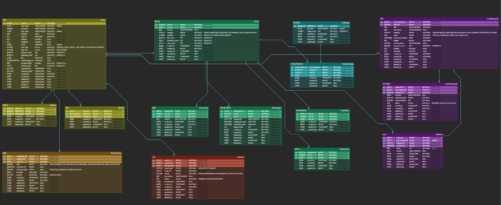

# 🦷 ProthSync — 치과 보철 매칭 플랫폼

> 치과 전문가들을 위한 소셜 네트워킹 + 비즈니스 매칭 플랫폼

ProthSync는 치과의사, 기공소, 기공사, 학생 등 치과 산업 종사자들이 작업물을 공유하고, 기공 외주를 의뢰·수주하며, 위치 기반으로 주변 서비스를 탐색할 수 있는 종합 플랫폼입니다.

---

## 목차

- [기술 스택](#기술-스택)
- [주요 기능](#주요-기능)
- [아키텍처](#아키텍처)
- [프로젝트 구조](#프로젝트-구조)
- [시작하기](#시작하기)
- [API 문서](#api-문서)
- [ERD](#erd)
- [향후 계획](#향후-계획)

---

## 기술 스택

| 분류             | 기술                                       |
| ---------------- | ------------------------------------------ |
| **Language**     | Java 17                                    |
| **Framework**    | Spring Boot 3.5                            |
| **Security**     | Spring Security, JWT (jjwt 0.12)           |
| **Database**     | PostgreSQL 18, Spring Data JPA (Hibernate) |
| **Cache**        | Redis 7                                    |
| **API Docs**     | SpringDoc OpenAPI (Swagger UI)             |
| **Monitoring**   | Spring AOP (실행 시간 로깅)                |
| **External API** | Kakao Geocoding API                        |
| **Infra**        | Docker Compose                             |
| **Build**        | Gradle                                     |

---

## 주요 기능

### 🔐 인증/인가

- JWT 기반 Stateless 인증 (Access Token + Refresh Token)
- Refresh Token Rotation 전략으로 보안 강화
- Redis 기반 Token Blacklist 관리
- BCrypt 패스워드 암호화
- Role 기반 접근 제어 (`USER`, `ADMIN`)

### 📱 소셜 기능

- **게시물** — 다중 이미지 업로드, 카테고리 분류, 공개/비공개 설정
- **댓글** — 게시물 댓글 CRUD
- **좋아요** — 게시물 좋아요 토글
- **팔로우** — 사용자 간 팔로우/언팔로우, 팔로워·팔로잉 목록 조회
- **해시태그** — 게시물 해시태그 등록 및 검색
- **피드** — 팔로우 기반 피드 조회
- **북마크** — 게시물 저장 기능
- **알림** — Polling 기반 알림 시스템 (좋아요, 댓글, 팔로우 등)

### 🔧 기공 의뢰 시스템

- **의뢰 등록** — 크라운, 브릿지, 의치, 임플란트 등 보철 카테고리별 의뢰 생성
- **제안서 제출** — 기공사/기공소가 의뢰에 대한 견적·제안 제출
- **워크플로우 관리** — `OPEN → IN_PROGRESS → COMPLETED / CANCELLED` 상태 전이
- **리뷰 시스템** — 완료된 의뢰에 대한 평점 및 리뷰 작성

### 📍 위치 기반 서비스

- Kakao Geocoding API 연동 (주소 → 좌표 변환)
- Haversine 공식 기반 주변 치과·기공소 검색
- 주변 의뢰 검색 (반경 기반)

### 🛡️ 관리자 기능

- 사용자 신고 접수 및 처리 (`PENDING → RESOLVED / DISMISSED`)
- 사용자 정지/해제 (기간 설정)
- 역할 변경 (USER ↔ ADMIN)
- 관리자 대시보드 (통계 조회)

### 🚫 차단 시스템

- 사용자 차단/해제
- 차단된 사용자의 콘텐츠 자동 필터링

---

## 아키텍처

```
┌──────────────────────────────────────────────┐
│                  Client                       │
└──────────────────┬───────────────────────────┘
                   │ HTTP (REST API)
┌──────────────────▼───────────────────────────┐
│              Controller Layer                  │
│  (Request Validation, Auth, Swagger Docs)     │
└──────────────────┬───────────────────────────┘
                   │
┌──────────────────▼───────────────────────────┐
│              Service Layer                     │
│  (Business Logic, Transaction Management)     │
└──────────┬───────────────────┬───────────────┘
           │                   │
┌──────────▼──────┐  ┌────────▼────────┐
│  Repository     │  │     Redis       │
│  (Interface →   │  │  (Token         │
│   Impl Pattern) │  │   Blacklist)    │
└──────────┬──────┘  └─────────────────┘
           │
┌──────────▼──────┐
│  PostgreSQL     │
│  (JPA/Hibernate)│
└─────────────────┘
```

### 설계 원칙

- **단방향 엔티티 관계** — JPA 연관관계 대신 ID 참조를 사용하여 결합도 최소화
- **3계층 Repository 패턴** — `JpaRepository → Interface → Implementation`으로 추상화
- **정적 팩토리 메서드** — 엔티티 생성 시 자체 검증 로직을 포함한 팩토리 패턴
- **커스텀 예외 체계** — `ErrorCode` 인터페이스 + `BusinessException`으로 도메인별 에러 관리
- **DTO 분리** — Request/Response DTO를 분리하고 Java Record 활용
- **Swagger 인터페이스 분리** — Controller와 API 문서를 별도 인터페이스로 분리

---

## 시작하기

### 사전 요구사항

- Java 17+
- Docker & Docker Compose

### 환경 변수 설정

프로젝트 루트에 `.env` 파일을 생성합니다:

```env
# PostgreSQL
POSTGRES_DB=prothsync
POSTGRES_USER=your_username
POSTGRES_PASSWORD=your_password

# Redis
REDIS_PASSWORD=your_redis_password

# JWT
JWT_SECRET=your_jwt_secret_key_at_least_256_bits
JWT_ACCESS_EXPIRATION=1800000      # 30분
JWT_REFRESH_EXPIRATION=604800000   # 7일

# Kakao API
KAKAO_REST_API_KEY=your_kakao_api_key

# Timezone
TZ=Asia/Seoul
```

### 실행

```bash
# 1. Docker 컨테이너 실행 (PostgreSQL + Redis)
docker compose up -d

# 2. 애플리케이션 빌드 및 실행
./gradlew bootRun
```

애플리케이션이 `http://localhost:8080`에서 실행됩니다.

---

## API 문서

애플리케이션 실행 후 Swagger UI에서 전체 API를 확인할 수 있습니다:

```
http://localhost:8080/swagger-ui/index.html
```

### 주요 API 엔드포인트

| 도메인     | 엔드포인트                               | 설명               |
| ---------- | ---------------------------------------- | ------------------ |
| **Auth**   | `POST /api/auth/signup`                  | 회원가입           |
|            | `POST /api/auth/login`                   | 로그인             |
|            | `POST /api/auth/refresh`                 | 토큰 갱신          |
|            | `POST /api/auth/logout`                  | 로그아웃           |
| **User**   | `GET /api/users/me`                      | 내 프로필 조회     |
|            | `GET /api/users/{userId}`                | 사용자 프로필 조회 |
|            | `PATCH /api/users/me`                    | 프로필 수정        |
| **Post**   | `POST /api/posts`                        | 게시물 작성        |
|            | `GET /api/posts/{postId}`                | 게시물 상세 조회   |
|            | `GET /api/feed`                          | 피드 조회          |
| **Case**   | `POST /api/case-requests`                | 의뢰 등록          |
|            | `POST /api/case-proposals`               | 제안서 제출        |
|            | `GET /api/case-requests/nearby`          | 주변 의뢰 검색     |
| **Social** | `POST /api/follows/{userId}`             | 팔로우             |
|            | `POST /api/posts/{postId}/likes`         | 좋아요             |
|            | `POST /api/posts/{postId}/comments`      | 댓글 작성          |
| **Admin**  | `GET /api/admin/dashboard`               | 대시보드           |
|            | `POST /api/admin/users/{userId}/suspend` | 사용자 정지        |
|            | `GET /api/admin/reports`                 | 신고 목록 조회     |

---

## ERD


